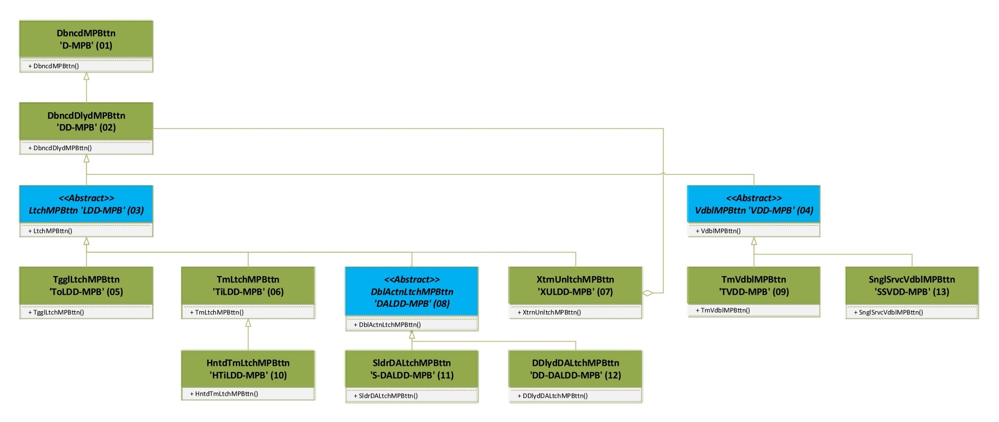

# Buttons to Switches Library for STM32 (_**ButtonToSwitch_STM32**_)

### An STM32-RTOS library that builds switch mechanisms replacements out of simple push buttons.  
By using just a button (a.k.a. push button, momentary switches or momentary buttons -_**MPB**_ for short from here on- the classes implemented in this library will manage, calculate and update different parameters to **generate the behavior of standard electromechanical switches**, including some well known industry specific switches. 
Those parameters include presses, releases, timings, counters or secondary inputs readings as needed, and corresponding primary and auxiliary outputs generated.  

### The main output flag generated for each and every class is the **isOn** flag, which defines the _**Off State**_ (isOn=false) and the _**On State**_ (isOn=true) of the instantiated objects.  

## The embedded behavior also includes logical replacements for temporary or extraordinay responses that usually need external hardware modifications in electromechanical switches:
- Switch disconnection.
- Switch bypassing
- Minimum pressing time for turning on/off.

All classes provide several communication mechanisms to keep it's output states available by request and by having their value change automatically notified.  
Those mechanisms include:    
	- **Flags value getters**: Return the value of each significant attribute flag.  
	- **General flags value change getter**: Returns a value indicating if **any** of the significant output flags' values has changed.  
	- **Lightweight Binary Semaphore**: Implementation of a **xTaskNotify()** FreeRTOS macro to unblock a developer defined task -every time **any** of the output flags' values changes- including a notification value indicating the state of the MPB.  
	- **Task Resume/Suspend**: A mechanism is provided to run a developer defined task while the object is in **On State**. The designated task will be set to "Suspended State" while the object is in **Off State** and will be set to "Resume" while it is in **On State**, providing means to execute far more complex tasks than just "turning On & turning Off" devices.  
	- **Functions execution**: A developer defined function might be set to be executed every time the instantiated object enters the **On State**, and a function might be set to be executed every time the instantiated object enters the **Off State**. The functions are to be independently defined, so one, the other or both might be defined, and even the same function might be used for both events.  
		 
Those listed mechanisms are **independent**, so one or more might be simultaneously used depending on implementation needs and convenience.    

The **Functions execution** mechanism is also available, so that other functions might be asigned to be executed every time a significant attribute flag's value changes, one for setting, one for resetting:
		- For the **HntdTmLtchMPBttn** class: Warning and Pilot attribute flags
		- For the **DDlydDALtchMPBttn** class: Secondary On attribute flag.
		- For the **TmVdblMPBttn** and the **SnglSrvcVDBLMPBttn**: isVoided attribute flag.
		- For other classes associated outputs functions read the classes documentation.   

### The library implements the following switches behaviors: ###  
* **Debounced Momentary Push Button** (a.k.a. Momentary switch, a.k.a. **Pushbutton**)  
* **Debounced Delayed Momentary Push Button** (a.k.a. **Delayed Pushbutton**)  
* **Toggle Switch Momentary Push Button** (a.k.a. Alternate Pushbutton, a.k.a. **Latched Switch**)  
* **Timer Toggled Momentary Push Button** (a.k.a. **Timer Switch**)  
* **Hinted Timer Toggled** (a.k.a. **Staircase Timer Switch**)
* **External Unlatch toggle** (a.k.a. **Emergency Latched Switch**)
* **Time Voidable Momentary Push Button**  (a.k.a. **Anti-Tampering Switch**)
* **Single Service Voidable Momentary Push Button**  (a.k.a. **Trigger Switch**) 
* **Short press/Long Press Double action On/Off + Slider combo switch**  (a.k.a. off/on/dimmer, a.k.a. **Off/On/Volume radio switch**)
* **Short press/Long Press Double action On/Off + Secondary output MPB combo switch**

ButtonToSwitch Library Documentation available **[HERE](https://gabygold67.github.io/ButtonToSwitch_STM32/)**

Each instantiated object returns a debounced, deglitched, clean "isOn" signal based on the expected behavior of the simulated switch mechanism. 

The system timer will periodically check the input pins associated to the objects and compute the object's internal state and output flags, the timer period for that checking is a general parameter that can be changed. 
